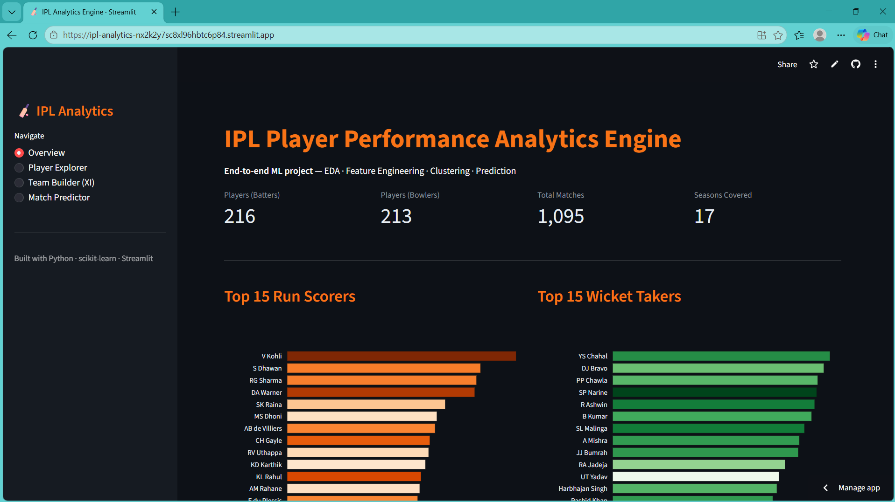

# 🏏 IPL Player Performance Prediction & Team Optimization Engine

> **A full end-to-end data science project** — from raw ball-by-ball IPL data to
> an interactive ML-powered dashboard for player analysis and team selection.

---

## 🚀 Live Demo

👉 **[Try the app here](https://ipl-analytics-nx2k2y7sc8xl96hbtc6p84.streamlit.app/)**



---

## 📌 Project Overview

This project builds a complete machine learning pipeline that:

1. **Analyses** 15+ years of IPL ball-by-ball data
2. **Engineers** meaningful cricket-specific features (phase performance, rolling form, venue splits)
3. **Scores** every player with a custom **Player Value Score (PVS)**
4. **Classifies** player archetypes using unsupervised clustering (K-Means)
5. **Predicts** batting performance using Random Forest regression
6. **Recommends** optimal playing XI combinations
7. **Serves** all insights via an interactive Streamlit dashboard

---

## 🗂️ Project Structure

```
ipl-analytics/
├── notebooks/
│   ├── week1_eda.py          # Data loading, cleaning, EDA
│   ├── week2_features.py     # Feature engineering & PVS
│   └── week3_models.py       # ML models (regression + clustering)
├── dashboard/
│   └── app.py                # Streamlit interactive dashboard
├── data/                     # CSVs go here (gitignored)
├── src/                      # Saved ML model .pkl files
├── requirements.txt
└── README.md
```

---

## 🚀 Getting Started

### 1. Clone & install dependencies
```bash
git clone https://github.com/sidharthmv9958-cpu/ipl-analytics.git
cd ipl-analytics
pip install -r requirements.txt
```

### 2. Download the dataset
Go to: https://www.kaggle.com/datasets/patrickb1912/ipl-complete-dataset-20082020

Download and place these two files in the `data/` folder:
- `matches.csv`
- `deliveries.csv`

### 3. Run the pipeline in order
```bash
# Week 1 — EDA
python notebooks/week1_eda.py

# Week 2 — Feature Engineering
python notebooks/week2_features.py

# Week 3 — ML Models
python notebooks/week3_models.py

# Week 4 — Dashboard
streamlit run dashboard/app.py
```

---

## 🧠 ML Techniques Used

| Component              | Technique                          |
|------------------------|------------------------------------|
| Run prediction         | Random Forest Regressor            |
| Player archetypes      | K-Means Clustering                 |
| Match outcome          | Gradient Boosting Classifier       |
| Feature normalisation  | Min-Max Scaling                    |
| Model evaluation       | Cross-validation, MAE, R², F1      |

---

## 📊 Features Engineered

- **Phase performance**: Powerplay / Middle / Death overs split stats
- **Rolling form**: 10-innings moving average of runs and strike rate
- **Venue performance**: Strike rate and runs at each ground
- **Player Value Score (PVS)**: Composite weighted metric combining average, strike rate, form, volume, and milestones

---

## 📈 Dashboard Pages

| Page               | What it shows                                      |
|--------------------|----------------------------------------------------|
| Overview           | Career leaders, archetype scatter, season trends   |
| Player Explorer    | Deep-dive stats + form chart for any player        |
| Team Builder (XI)  | PVS-ranked player picker for building a lineup     |
| Match Predictor    | Win probability given teams, toss, venue           |

---

## 🌐 Deployment

Deploy the dashboard for free on **Streamlit Community Cloud**:
1. Push to GitHub
2. Go to https://streamlit.io/cloud → New app → Connect repo
3. Set main file: `dashboard/app.py`

---

## 🛠️ Tech Stack

`Python` · `pandas` · `NumPy` · `scikit-learn` · `Matplotlib` · `Seaborn` · `Plotly` · `Streamlit` · `joblib`

---

## 💡 Ideas to Extend

- [ ] Add IPL 2021–2024 data for recency
- [ ] Include fielding stats (catches, run-outs)
- [ ] Add pitch/weather condition features
- [ ] Build a fantasy team optimizer
- [ ] Deploy as a public Streamlit app

---

## 👨‍💻 Author

Built as a portfolio data science project.  
Connect on [LinkedIn](https://linkedin.com/sidharthmv9958) | [GitHub](https://github.com/sidharthmv9958-cpu)
